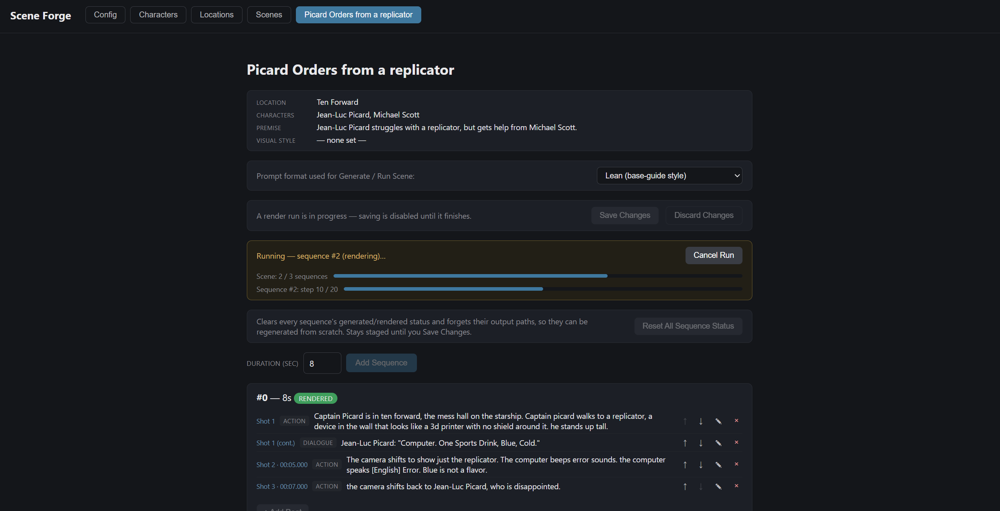

# H3SceneManager



A local web app for authoring multi-character, multi-shot video/audio scenes and compiling them into correctly-wired [ComfyUI](https://github.com/comfyanonymous/ComfyUI) workflows for **MiniMax H3 (Ref2VA checkpoint)**.

Define a cast and a setting once, compose multi-shot sequences with dialogue, and get correctly-wired, correctly-worded ComfyUI workflows out the other end — generated as downloadable JSON, or submitted straight to a running ComfyUI instance and rendered end-to-end.

---

## What is this?

H3SceneManager is a Flask + vanilla-JS app that sits in front of ComfyUI. Instead of hand-building a workflow graph and hand-writing a MiniMax prompt for every single shot, you maintain a small structured database — **Characters** (face/voice references, appearance), **Locations** (reference image, visual/soundscape description), and **Scenes** (a location, a cast, and an ordered list of **Sequences**, each made of **Beats** — action or dialogue) — and H3SceneManager compiles that into:

- A ComfyUI workflow JSON, with a group of nodes duplicated and wired per cast member (face + voice reference images/audio routed into the correct `ref_images`/`ref_audios` slots), respecting ComfyUI's hard reference caps.
- A correctly-formatted MiniMax prompt (either the full six-section "rewrite guide" style, or a leaner "base guide" style — your choice, per generation), with consistent `<Subject N>` / `<Picture N>` / `<Audio N>` tagging, first-appearance-only redescription, and per-sequence speaker numbering.

From there you can either download the workflow JSON to run in ComfyUI yourself, or hit **Run Scene** and let H3SceneManager submit every un-rendered sequence to a local ComfyUI instance in order, chaining each sequence's actual rendered output into the next one automatically.

## What problems does this solve?

- **Manual graph-wiring is tedious and error-prone.** Duplicating a character group, rewiring Face/Voice into the right reference slots, and staying under ComfyUI's hard image/audio caps by hand doesn't scale past a shot or two.
- **MiniMax's prompt format is fiddly to write correctly by hand.** Consistent subject numbering, tag citations, first-appearance-only descriptions, and (for Ref2VA specifically) the six-section rewrite-guide structure are easy to get subtly wrong, and subtle formatting mistakes are hard to notice just by reading the prompt back.
- **Multi-shot continuity needs bookkeeping.** Chaining a sequence's last frame into the next one, and keeping character/location identity consistent shot-to-shot, is exactly the kind of detail that's easy to lose track of when you're doing it by hand across a dozen shots.
- **Running a whole scene means a lot of manual queue-and-wait.** Without automation, rendering an N-sequence scene means manually submitting each one to ComfyUI, waiting for it to finish, finding the output file, and feeding its path into the next sequence — N times. H3SceneManager's **Run Scene** does this in one click, with live per-sequence progress.
- **Fast iteration on what actually works.** Prompt format, resolution, and seed are all things worth A/B-testing empirically rather than trusting the docs blindly — H3SceneManager makes format, resolution, and seed a per-generation choice rather than something baked into saved data, so you can compare results shot-to-shot without re-entering anything.

---

## Requirements

### ComfyUI setup

H3SceneManager doesn't run any generation itself — it produces workflow JSON for, and optionally talks to, your own ComfyUI instance. Your ComfyUI install needs:

- **MiniMax H3, Ref2VA checkpoint.** The whole prompt format and node-wiring logic is built around this specific checkpoint.
- **[FirstFrameLastFrameExtractor](https://github.com/RmaNMetaverse/ComfyUI-FirstframeLastframeExtractor)** node. Used to chain sequences together — it extracts the last frame of a rendered sequence so the next sequence in the scene can anchor its first shot to it. Required for multi-sequence scenes to chain correctly.
- **[Workflow to API Converter Endpoint](https://github.com/SethRobinson/comfyui-workflow-to-api-converter-endpoint)** custom node, by Seth A. Robinson. **Required for the "Run Scene" automation feature.** ComfyUI's `/prompt` endpoint only accepts API-format workflow JSON, but the workflow H3SceneManager generates is UI/"Save"-format (the format `template_engine.py` needs to work with, to duplicate groups and rewire nodes). This custom node adds a `/workflow/convert` endpoint that converts UI-format → API-format on the fly, which is what lets H3SceneManager submit a generated workflow straight to ComfyUI without you manually re-saving it from the ComfyUI UI first. If you only ever plan to download workflow JSON and queue it yourself from the ComfyUI UI, you don't strictly need this — but you won't be able to use Run Scene without it.
- **A base template workflow** (`data/templates/Grant_Template_Workflow.json`) with `{{ }}`-marked template nodes/groups that H3SceneManager duplicates per character. This ships with the project; you generally shouldn't need to touch it.

### Python

- Python 3, Flask. No database — everything is JSON files on disk under `data/`.
- Optional: [`websocket-client`](https://pypi.org/project/websocket-client/) — enables live, per-step render progress during a Run Scene job (reads ComfyUI's `/ws` progress events). Without it, Run Scene still works fully via REST polling alone; you just won't see a live percentage, only the current stage name (generating/converting/queued/rendering).

Both are listed in `requirements.txt`.

---

## Getting started

```bash
git clone https://github.com/Tenderfoot/H3SceneManager.git
cd H3SceneManager
pip install -r requirements.txt

python3 app.py
```

Then open the app in your browser and go to the **Config** tab first to point H3SceneManager at your ComfyUI instance:

| Setting | What it's for |
|---|---|
| ComfyUI URL | Where your ComfyUI instance is running (default `http://127.0.0.1:8188`) |
| ComfyUI output directory | **Must be the exact folder your ComfyUI install writes rendered video to.** H3SceneManager reads this directly (same-machine, shared filesystem) to confirm a render landed and record its real path for chaining into the next sequence. |
| ComfyUI input directory | Where ComfyUI's `LoadImage`/`LoadAudio` nodes look for reference files. H3SceneManager doesn't read/write here itself — it's just context for where your face/voice/location reference filenames should live. |
| Poll interval / render timeout | How often H3SceneManager checks ComfyUI for job completion, and how long it'll wait before giving up on a stuck render. |

These are saved to `data/config.json` and take effect immediately, no restart needed.

---

## Using it

1. **Characters** — name, face reference image, voice reference audio, and an appearance description (hair, build, clothing — anything you want preserved, as plain text).
2. **Locations** — name, reference image, visual description, and a soundscape description.
3. **Scenes** — pick a location, cast your characters (with a per-character "include voice reference" toggle), set a premise and visual style, then open the scene to build it out:
   - Add **Sequences** (5–10s chunks, chained in order).
   - Add **Beats** to each sequence — action or dialogue, optionally marking whether a beat starts a new shot or folds into the one before it.
   - **Generate workflow JSON** for a single sequence, or **Run Scene** to submit every un-rendered sequence in order automatically, with live progress and automatic chaining.
   - Prompt format (lean vs. full), resolution, and seed randomization are all chosen live, right before you generate or run — not saved to the scene, so you're free to mix settings sequence-to-sequence and compare results.

---

## Project layout

```
app.py                  Flask backend: REST CRUD, generation, Run Scene automation, config
engine/
  models.py              Plain-dataclass data model (Character, Location, Scene, Sequence, Beat, ...)
  storage.py              JSON-file storage
  template_engine.py     Duplicates/wires the ComfyUI workflow graph per scene
  prompt_compiler.py      Compiles the MiniMax prompt (lean and full formats)
  comfy_client.py          Talks to ComfyUI: submit, poll, live progress, locate output files
data/
  templates/Grant_Template_Workflow.json   Base ComfyUI workflow template
  characters/ locations/ scenes/            Saved entities, one JSON file each
  generated_workflows/                       Workflow JSON written per generate/run
  config.json                                 ComfyUI connection settings
static/
  index.html, app.js, style.css              Frontend
```

No database, no build step — `python3 app.py` and you're running.
